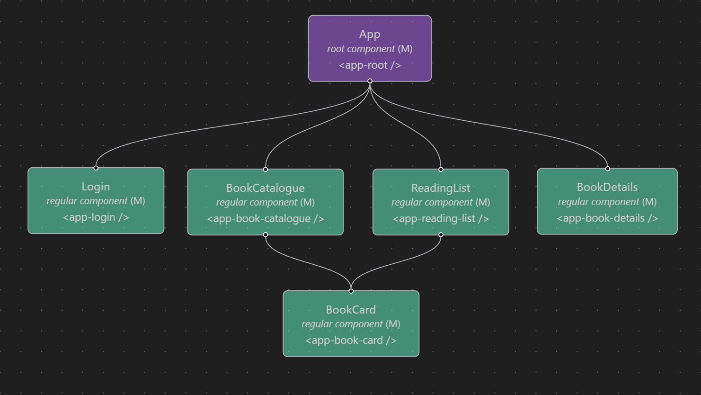

# ShelfHelp
Welcome to the ShelfHelp project! This is a web application where users can browse books and add them to their personal reading list. The project is written in Angular, using Angular Material for UI components and Tailwind CSS for styling.

## Project Structure

These are the core files and folders in the project:    
```
shelf-help/
├── src/
│   ├── app/                        
│   │   ├── api/                 
│   │   │   ├── book-api/           # Book API logic and models
│   │   │   └── library-store/      # State management for the project
│   │   ├── components/          
│   │   │   ├── book-card/          # Book card component
│   │   │   ├── navbar/             # Navigation bar component
│   │   ├── pages/               
│   │   │   ├── book-catalogue/     # Book catalogue page
│   │   │   ├── book-details/       # Book details page
│   │   │   ├── login/              # Login page
│   │   │   ├── reading-list/       # User's reading list page
│   │   ├── environments/           # Providing API key and URL
│   │   ├── app.routes              # Application routing configuration
│   │   ├── app.config              # App-wide configuration
│   │   ├── app                     # Root app component and module
│   ├── index.html                  # Main HTML entry point
│   ├── main                        # Application bootstrap file
│   ├── styles.css                  # Global styles
│   └── material.theme.css          # Angular Material theme overrides
├── public/                         # Static assets (images)
```

This component tree shows the project structure as planned before development. It was created using GraphLenz in VSCode.


The following component tree is generated after development, showing no difference except the external navbar component and color changes illustrating which pages are accessible through routing 


## Tech stack

- [Angular with Angular CLI](https://angular.dev/): A framework for building client applications in HTML and TypeScript.
- [Angular Material](https://material.angular.dev/): A UI component library for Angular, providing premade components.
- [Tailwind CSS](https://tailwindcss.com/): A CSS framework used for styling the application.
- Vitest: A fast and lightweight testing framework for JavaScript and TypeScript, used for unit testing in this project.
- [Render](https://render.com/): The project uses Render to host an API, providing data to the application. The books delivered by the api is provided as part of the project assignment.


## Development server
Before running the project, ensure you have Node.js and npm installed on your machine. You can download them from [Node.js official website](https://nodejs.org/).

You also need to add an environment variable for the API URL. Navigate to src/app/environments and add an environment.ts file with the following content:

```typescript
export const environment = {
  production: false,
  apiKey: 'void-academy-api-key-123', // Add your API key if needed
  apiUrl: 'https://frontend-assignment-api-sgtk.onrender.com'
};
```
**Note:** The API key provided is for demonstration purposes. In a real production application, you should secure your API keys and not expose them in the client-side code.

```bash

To run the project locally, first install the project dependencies by running:

```bash
npm install
```

Then, run the server by executing:

```bash
ng serve
```

Once the server is running, open your browser and navigate to `http://localhost:4200/`. The application will automatically reload whenever you modify any of the source files.


## For developers

### Building

To build the project run:

```bash
ng build
```

This will compile the project and store the build artifacts in the `dist/` directory. 

### Running unit tests

To execute unit tests with the [Vitest](https://vitest.dev/) test runner, run ``ng test``

### Running end-to-end tests
> **Note:** End-to-end (e2e) testing is not implemented yet.

For end-to-end (e2e) testing, run: ``ng e2e``

### Additional Resources

For more information on using the Angular CLI, including detailed command references, visit the [Angular CLI Overview and Command Reference](https://angular.dev/tools/cli) page.
